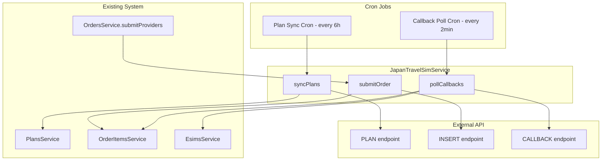

# JAPANTRAVELSIM Provider Integration Plan

## Overview

Integrate JAPANTRAVELSIM as a new eSIM provider into the existing multi-provider architecture. This provider sells Japan-only eSIMs via a REST API with three endpoints: Plan (get products), Insert (place order), and Callback (poll order status).

## API Summary

| Endpoint | URL (Live) | Method | Purpose |
|----------|-----------|--------|---------|
| Plan | `https://japantravelsim.com/api/v2/plan.php` | POST | Fetch available plans |
| Insert | `https://japantravelsim.com/api/v2/` | POST | Place an order |
| Callback | `https://japantravelsim.com/api/v2/callback.php` | POST | Poll order result |

Auth: `mb_id` + `apikey` + `apitoken` in request body (no HMAC signature).

## Architecture Diagram



## Integration Points

### 1. Plan Sync (Cron)

Follows the same pattern as `AiraloService.syncPlans` and `EsimAccessService.syncPlans`:

- Call PLAN API with `group: plan` (and optionally planb, planc, pland) with `view: 1` (only sellable)
- Convert JPY price to USD using `https://open.er-api.com/v6/latest/JPY` rate
- Upsert plans into DB with `provider: japantravelsim`, `providerPlanId: deviceSkuId`
- Deactivate stale plans not seen in latest sync
- Destination is always Japan (resolve once, cache)
- Integrated into `SyncOrchestratorService.runFullSync` alongside Airalo and EsimAccess

### 2. Order Submission

Follows the same pattern as GadgetKorea in `OrdersService.submitProviders`:

- Filter order items where `plan.provider === japantravelsim`
- Call INSERT API with order data
- Store `channelOrderId` from response as `orderRequestId` on the order item
- Order item status remains `pending` until callback confirms

### 3. Callback Polling (Cron)

New pattern - no other provider uses polling. Runs every 2 minutes:

- Find all order items with `provider = japantravelsim` AND `status = pending` AND `orderRequestId IS NOT NULL`
- Batch channelOrderIds (max 10 per API call)
- Call CALLBACK API
- For each result with `status = 0` (complete): create esim record, update order item to `completed`
- For each result with `status = 2` (cancel): update order item to `failed`
- Send esim purchase email on completion

## Files to Create/Modify

### New Files

| File | Purpose |
|------|---------|
| `src/esim-providers/japantravelsim/japantravelsim.service.ts` | API client + syncPlans + submitOrder + pollCallbacks |
| `src/esim-providers/japantravelsim/japantravelsim-api.types.ts` | TypeScript types for API request/response |
| `src/esim-providers/config/japantravelsim-config.type.ts` | Config type definition |
| `src/esim-providers/config/japantravelsim.config.ts` | Config registration with env validation |

### Modified Files

| File | Change |
|------|--------|
| `src/esim-providers/esim-providers.module.ts` | Register JapanTravelSimService as provider |
| `src/esim-providers/sync-orchestrator.service.ts` | Add japantravelsim sync to runFullSync |
| `src/config/config.type.ts` | Add JapanTravelSimConfig to AllConfigType |
| `src/orders/orders.service.ts` | Add japantravelsim branch in submitProviders + submitOrder |
| `src/orders/orders.module.ts` | Import if needed |
| `src/app.module.ts` | Register japantravelsim config |
| `env-example-relational` | Add JAPANTRAVELSIM env vars |

## Environment Variables

```
JAPANTRAVELSIM_MB_ID=
JAPANTRAVELSIM_API_KEY=
JAPANTRAVELSIM_API_TOKEN=
JAPANTRAVELSIM_BASE_URL=https://japantravelsim.com
```

## Detailed Implementation Steps

### Step 1: Config Layer

Create config type and registration:
- `japantravelsim-config.type.ts`: `{ mbId, apiKey, apiToken, baseUrl }`
- `japantravelsim.config.ts`: registerAs with env validation
- Update `config.type.ts` AllConfigType
- Update `app.module.ts` to load the config

### Step 2: API Types

Define TypeScript interfaces in `japantravelsim-api.types.ts`:
- `JapanTravelSimPlanRequest` / `JapanTravelSimPlanResponse`
- `JapanTravelSimInsertRequest` / `JapanTravelSimInsertResponse`
- `JapanTravelSimCallbackRequest` / `JapanTravelSimCallbackResponse`

### Step 3: Service Implementation

`JapanTravelSimService` with methods:

```typescript
// Plan sync
async syncPlans(): Promise<void>

// Order placement
async submitOrder(params: {
  orderId: string;
  items: Array<{
    OrderId: string;
    deviceSkuId: string;
    days: number;
    start_date: string;
    email: string;
  }>;
}): Promise<JapanTravelSimInsertResponse>

// Callback polling
async pollPendingOrders(channelOrderIds: string[]): Promise<JapanTravelSimCallbackResponse>
```

### Step 4: Integrate into Sync Orchestrator

Add to `SyncOrchestratorService.runFullSync`:
```typescript
try {
  await this.japanTravelSimService.syncPlans();
} catch (error: any) {
  this.logger.error('JapanTravelSim sync failed: ' + error.message);
}
```

### Step 5: Integrate into Order Flow

In `OrdersService.submitProviders` and `OrdersService.submitOrder`, add a new branch:
```typescript
const japanTravelSimItems = itemsWithPlans.filter(
  i => i.plan.provider === 'japantravelsim'
);
```

Call INSERT API, store channelOrderId as orderRequestId.

### Step 6: Callback Polling Cron

Add `@Cron('*/2 * * * *')` method in `JapanTravelSimService`:
- Query pending order items for this provider
- Batch into groups of 10
- Call CALLBACK API
- Process results: create esim records, update statuses

### Step 7: Module Registration

Update `EsimProvidersModule`:
- Add `JapanTravelSimService` to providers and exports

## Key Design Decisions

1. **JPY → USD conversion**: Fetch JPY rate during plan sync, convert `plan_price` to USD before storing. The existing `updateVndPrices` cron handles USD → VND.

2. **Polling vs Webhook**: JAPANTRAVELSIM callback is a pull model (we call them). A cron every 2 minutes handles this. No webhook endpoint needed.

3. **Group handling**: The API has multiple groups (plan, planb, planc, pland). Sync all groups, use `wr_group` as metadata to map correctly during order placement.

4. **Batch limit**: INSERT API allows max 10 items per call. If an order has more than 10 japantravelsim items, split into multiple API calls.

5. **start_date**: Use the order creation date or next day as start_date when submitting orders.

6. **Email**: Use customer email from user profile for the `email` field in INSERT request.

7. **QR code data**: The callback returns `qrcodecontent` which maps to `activationCode` in our esim model.
